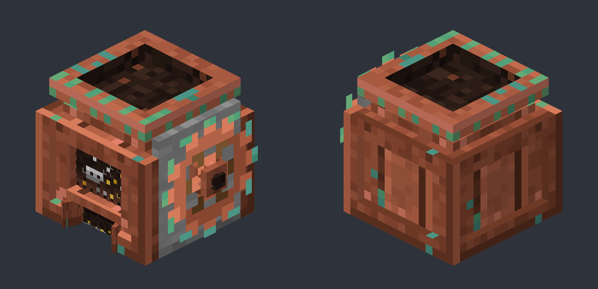

# Disassembly Delight (`disassembly_delight`)

A NeoForge 1.21.1 add-on for [Farmer's Delight](https://github.com/vectorwing/FarmersDelight) that takes things apart.

It adds the **Disassembly Table**, a hopper-fed machine that disassembles whatever you feed it, and, with Sophisticated Backpacks installed, the **Disassembly Table Upgrade**, which returns the full ingredients of any crafting recipe straight into your backpack. Neither one ever destroys what is stored inside a container: shulker boxes, backpacks, toolboxes and the like are emptied first.

By Renzo.



| | |
|---|---|
| Minecraft | 1.21.1 |
| Loader | NeoForge 21.1+ |
| Required | Farmer's Delight 1.2+ |
| Optional | Sophisticated Backpacks 3.20+ (for the upgrade) |
| Not required | Farmer's Delight Tweaks (but see Migration if you used its Decrafter) |

## Coming from Farmer's Delight Tweaks? Read this first

The Disassembly Table **is** the old **Decrafter** from Farmer's Delight Tweaks, and the Disassembly Table Upgrade is the old **Decrafter Upgrade**. Farmer's Delight Tweaks 1.1.0 removed both and they live here now.

- **Install Disassembly Delight together with Farmer's Delight Tweaks 1.1.0 before you open an existing world.** Decrafters already placed in the world become Disassembly Tables with their inventory intact, Decrafter items in chests and inventories become Disassembly Table items, and Decrafter Upgrades inside backpacks become Disassembly Table Upgrades with their input slot intact.
- **If you update Farmer's Delight Tweaks to 1.1.0 without this mod, every Decrafter and Decrafter Upgrade in the world is deleted when it loads.** Farmer's Delight Tweaks 1.1.0 logs a warning at startup when Disassembly Delight is missing. Back up your world before updating.
- Disassembly Delight refuses to start next to Farmer's Delight Tweaks **1.0.x** (it would give you two copies of the same machine and the old ids could not be mapped). Update both mods at the same time.

### How the migration works

Disassembly Delight registers NeoForge registry aliases from the old ids to the new ones:

| Old id (Farmer's Delight Tweaks 1.0.x) | New id |
|---|---|
| `fd_storage_compat:decrafter` (block, item, block entity type, menu) | `disassembly_delight:disassembler` |
| `fd_storage_compat:decrafter_upgrade` (item) | `disassembly_delight:disassembler_upgrade` |
| `fd_storage_compat:full_uncraft` (recipe type and serializer) | `disassembly_delight:full_uncraft` |

An alias only applies when nothing else owns the old id, which is why Farmer's Delight Tweaks has to be 1.1.0 or newer. The block entity still saves its inventory under the same `Items` and `Progress` keys, and the upgrade still keeps its input slot in the same Sophisticated Core component, so saved data loads unchanged. The next save writes the new ids. Datapacks that add recipes with `"type": "fd_storage_compat:full_uncraft"` keep working, but new datapacks should use `disassembly_delight:full_uncraft`.

This is covered by tests (`LegacyAliasesTest`, `LegacyMigrationGameTests`): every old id resolves to the new entry, a block entity saved by the old Decrafter loads with its items and keeps working, an old upgrade stack keeps its input slot, and a recipe with the old type loads.

## The Disassembly Table

Craft it on a crafting table:

```
C C C
K A P
C C C
```

- `C` = Farmer's Delight cutting board
- `K` = any knife (`#c:tools/knife`)
- `A` = any axe (`#minecraft:axes`)
- `P` = any pickaxe (`#minecraft:pickaxes`)

It is a copper machine: a hopper on top, a window into the chamber and an output chute on the front, and a cog on one side. When placed, the front faces you. It breaks by hand and always drops itself (a pickaxe or axe is faster).

It works like an automatic cutting board with the tools built in, so there is no tool slot. Insert from the top or sides (hoppers, pipes) and extract from the bottom. Right-click it to open its GUI: one input slot and a 3×3 output grid. It processes one operation per second and gives a comparator signal based on how full it is.

What it does with an item, in order:

1. **Planks → 2 matching wooden slabs**
2. **Wooden slabs → 1 stick** (run wood through twice for the old stick rate)
3. **Beds → 3 matching wool + 3 oak planks**
4. **Mob heads → matching spawn egg** (vanilla heads, plus modded `*_head` / `*_skull` items when a matching spawn egg exists)
5. **Any Farmer's Delight cutting-board recipe**, matched by input only, with every listed result (no chance rolls)
6. **Reverse crafting** for everything else (damaged tools and armor are skipped)

Items it cannot disassemble are moved to the outputs unchanged, so a hopper line never jams. The Disassembly Table item itself always passes through unchanged and has no breakdown. The Disassembly Table Upgrade does come apart, into its recipe (see below). Sophisticated backpacks come down one tier at a time, as described in [Backpacks](#backpacks). If a recipe needs more of an item than is in the slot (4 torches from a 4-torch craft), it waits a few seconds for more before passing the short stack through.

## The Disassembly Table Upgrade

With Sophisticated Backpacks installed, one backpack upgrade is added: the **Disassembly Table Upgrade** (`disassembly_delight:disassembler_upgrade`).

Craft it with a shaped recipe:

```
  T
H U H
R R R
```

- `T` = Disassembly Table (`disassembly_delight:disassembler`)
- `H` = hopper
- `U` = Sophisticated Backpacks upgrade base (`sophisticatedbackpacks:upgrade_base`)
- `R` = redstone dust

JEI and the recipe book show this recipe (it is a normal shaped recipe in `data/disassembly_delight/recipe/disassembler_upgrade.json`). The old leather recipe is gone.

Only one fits in a backpack. Open the backpack, open the upgrade tab, and put an item in its input slot, either by clicking it in or by shift-clicking it from your inventory while the tab is open (upgrade items still install or go into storage when shift-clicked):

- If the item has a crafting recipe, the **full ingredient counts** go into the backpack.
- Tag ingredients use the item this mod picked in its `full_uncraft` data, or the first registered item in the tag.
- Items with no usable crafting recipe use this mod's `full_uncraft` recipes when there is one.
- Otherwise the Disassembly Table's rules apply: planks → 2 slabs, wooden slabs → 1 stick, beds → 3 wool + 3 oak planks, mob heads → spawn egg, and any Farmer's Delight cutting-board recipe (every listed result). So logs, raw meat, fish, flowers, pies and the like come apart too.
- Items with none of these move into the backpack unchanged.
- The Disassembly Table moves into the backpack unchanged. It is never taken apart.
- A spare Disassembly Table Upgrade is taken apart into its recipe: 1 Disassembly Table, 2 hoppers, 1 upgrade base and 3 redstone. The table block does the same with an upgrade fed into it.
- Backpacks come down one tier, with their contents (see [Backpacks](#backpacks)).
- Damaged tools are disassembled anyway.
- If the ingredients (and anything stored inside the item) do not fit, the item stays in the slot.
- The tab shows a preview of what will come out.

The Disassembly Table block keeps partial cutting-board yields. Full counts come through the upgrade, and through the backpack chain and the upgrade's own breakdown, which are the same in both.

## Backpacks

Both the table and the upgrade take a Sophisticated backpack down **one tier at a time**. The result is the next-lower backpack plus the materials of that tier step, and everything stored in the backpack moves into the lower backpack:

| Input | Output |
|---|---|
| Emerald backpack (Sophisticated Emerald Upgrade) | netherite backpack + 1 block of emerald + 1 emerald upgrade template |
| Netherite backpack | diamond backpack + 1 netherite ingot |
| Diamond backpack | gold backpack + 8 diamonds |
| Gold backpack | iron backpack + 8 gold ingots |
| Iron backpack | copper backpack + 4 iron ingots |
| Copper backpack | backpack + 8 copper ingots |
| Backpack | everything stored inside and the installed upgrades, then 1 chest + 4 leather + 4 string |

Notes on the chain:

- Iron returns 4 iron ingots because that is what the copper → iron recipe costs. Returning 8 would turn a copper backpack plus 4 iron into 8 iron, an endless iron source.
- Netherite returns no smithing template. This is deliberate.
- The steps are ordinary `full_uncraft` recipes under `data/disassembly_delight/recipe/full_uncraft/sophisticatedbackpacks/`, so a datapack can change them.

What carries over into the lower backpack:

- **Inventory**: slot for slot, as long as the lower tier has that slot. Items in slots the lower tier does not have come out as overflow.
- **Upgrades**: as many as the lower tier has upgrade slots. Stack upgrades are kept first (largest first), then an Inception upgrade, then the rest in slot order. The upgrades that do not fit come out as overflow. If a stack upgrade had to come out, stacks bigger than the remaining limit are split and the rest overflows.
- A backpack inside the backpack stays only if an Inception upgrade is kept; otherwise it comes out as overflow.
- Settings, the color and the name are kept. The lower backpack gets a new storage id, so it does not share storage with the backpack it came from.
- A backpack linked to a Sophisticated endpoint passes through unchanged.

Overflow never disappears:

- **Table**: the lower backpack, the materials and the overflow go into the 9 output slots. Anything that does not fit waits in an internal buffer that empties into the outputs as space frees up. The table takes no new input until the buffer is empty. The buffer is saved with the block and drops if the block is broken.
- **Upgrade**: everything goes into the host backpack. What does not fit is dropped at your feet. Sophisticated Backpacks only lets a backpack hold another backpack when it has an **Inception upgrade**, so without one the input waits in the slot.

## Stored contents

Neither the table nor the upgrade destroys what is inside a container. When either one disassembles a container, the stored items come out first, then the container's own results. If all of that does not fit (the table's 9 output slots, or the backpack), nothing is used up and the container waits. A container whose contents could never fit in 9 empty slots (a full shulker box) passes through the table whole. Sophisticated backpacks are the exception: they follow [Backpacks](#backpacks), and the table buffers what does not fit instead of waiting.

Read and emptied: shulker boxes, bundles, decorated pots, charged crossbows, pick-block copies of chests, barrels, furnaces, cabinets and baskets, Sophisticated Backpacks and Storage (inventory and upgrades, including Sophisticated Emerald Upgrade storage), Sophisticated upgrades with an inventory, Create toolboxes, Supplementaries safe, sack, presents, jar, urn, quiver and lunch basket, Farmer's Delight and Miner's Delight cooking pots and the skillet, Tide rods and the fish satchel, Construction Wand cores and the void sack. Create packages are unwrapped: the contents come out and the package is used up.

Passed through unchanged: Create minecart contraptions, Some Assembly Required sandwiches, Sophisticated Storage in Motion carts and boats, and anything holding a fluid, a mob, an unrolled loot table, pick-block block entity data, a linked Sophisticated endpoint, or item data this mod cannot read.

The rules are in [`src/main/resources/disassembly_delight/container_rules.json`](src/main/resources/disassembly_delight/container_rules.json). Other mods' components are looked up by id, so none of those mods is a dependency.

## Datapacks: `full_uncraft` recipes

The upgrade's full returns for items without a usable crafting recipe, the backpack chain and the upgrade's own breakdown come from `disassembly_delight:full_uncraft` recipes:

```json
{
  "type": "disassembly_delight:full_uncraft",
  "input": { "item": "farmersdelight:canvas" },
  "consume": 1,
  "results": [ { "id": "farmersdelight:straw", "count": 4 } ]
}
```

`consume` is how many input items one operation uses (default 1). The bundled recipes cover Farmer's Delight, Create, Sophisticated Backpacks/Storage, Supplementaries, Handcrafted, Quark and several Delight add-ons, each gated with `neoforge:mod_loaded`. `scripts/generate_full_uncraft.py` regenerates them from the cutting-board recipes in a Farmer's Delight Tweaks checkout (`FDT_ROOT`).

## Building and testing

The build needs three mod jars in `libs/` (not committed): `FarmersDelight.jar`, `sophisticatedcore.jar` and `sophisticatedbackpacks.jar` for NeoForge 1.21.1. Java 21.

```bash
./gradlew build              # jar: build/libs/disassembly_delight-<version>.jar
./gradlew test               # JUnit (contents reader, migration aliases, backpack tier transfer, recipe and model data)
./gradlew runGameTestServer  # in-world GameTests (container emptying, backpack chain, table block, legacy Decrafter migration)
./gradlew checkContainerCoverage  # every container item in the pack scan is emptied or passes through
```

The block art is generated by scripts: `scripts/paint_copper_textures.py` paints the textures, `scripts/build_disassembler_model.py` writes the block model, and `scripts/render_preview.py <model> <out.png>` renders the preview above (it needs the vanilla textures extracted from the Minecraft client jar for `minecraft:` references).

`checkContainerCoverage` (also part of `./gradlew check`) needs a modpack scan folder (`FD_DECRAFT_SCAN`, default `/workspace/fd-decraft-scan`) and is skipped when it is missing.

## Credits and license

Made by Renzo. MIT licensed, see [LICENSE](LICENSE).

The Disassembly Table textures are original copper pixel art by Renzo; the model also uses the vanilla glass and smooth stone textures, which are Mojang's. Farmer's Delight is by vectorwing.
